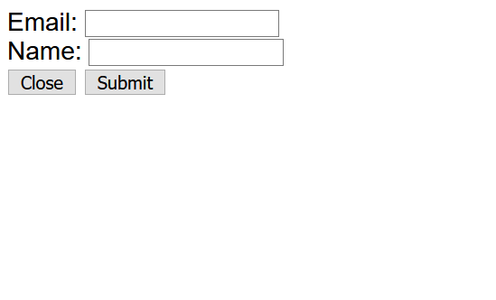

# Tute 05

## 1. Code Review

Take a look at `review.html`.
 * What is wrong with the style of the source code for this page?
 * Make appropriate changes to clean up these DOM elements.

> Largely the problems with this is that there is a lack of loops and lack of functions to help separate things out
> There are many ways you can take this, but you don't have a lot of time, but trying to avoid repeated code and abstract into functions would be the key thing

## 2. Promises

### Part 1: Find the error

Look at `fetchme.html`.

Why is this page not working as intended?

1. Fix the issue, so that the correct text loads
2. Handle the error case, such that if there is an issue during fetch that an appropriate error message is displayed

> Firstly, on some browsers, you may be able to fetch directly from a local file (depending on how the web server or file server is setup). For this reason sometimes its good to run our local files within an HTTP server itself, that simply serves the local files
> To do this we can run `python3 -m http.server` and then load `localhost:8000/fetchme.html` in the browser.
> Fetch needs to be dealt with as a promise. See `solutions/fetch.html`

### Part 2: SetTimeout and Promises

You are given the following promises each with a separate setTimeout:

```
const promise1 = new Promise((resolve, reject) => {
    setTimeout(() => { resolve(1);}, 500);
});
  
const promise2 = new Promise((resolve, reject) => {
    setTimeout(() => { resolve(2); }, 400);
});

const promise3 = new Promise((resolve, reject) => {
    setTimeout(() => { resolve(3);}, 300); 
});
```

1. What would be the output of this code?

```
Promise.all([promise1, promise2,promise3]).then((res) => {
    console.log(res[0]);
    console.log(res[1]);
    console.log(res[2]);
});
```

> 1
> 2
> 3

2. What would be the output of this code?

```
promise1.then((res) => { console.log(res); }, (err) => { alert(err);});
promise2.then((res) => { console.log(res); }, (err) => { alert(err);});
promise3.then((res) => { console.log(res); }, (err) => { alert(err);});
```

> 3
> 2
> 1

3. Why are the results different even though the promises are the same?

> The Promise.all() takes an iterable array of promises as an input and the returned promise will resolve when all of the input's promises in the order that they were input in.
> Whereas, in the second question as all the promises have a separate setTimeout value, the results of the promises are in the order that it would take the setTimeout to resolve

### Bonus Activity

Check out [randommer](https://randommer.io/api/swagger-docs/index.html) and their API docs. Get an [API key](https://randommer.io/randommer-api) so that you can fetch requests from them.

Use your knowledge of fetch and DOM manipulation to build a page that will, using a `setTimeout` render a random name to the page every 1 second.

## 3. Accessibility

Take a look at `https://mcdonalds.com.au/`. Analyse the site both in terms of:
 * Looking at the webpage as is, and in different sizes
 * The source code provided

Identify aspects of this site that could be improved with more accessible design/implementation considerations.

Use the lighthouse chrome extension to discuss other issues on the website.

> Buttons do not have accessible names
> Image elements do have [alt] attributes
> Form elements do not have associated labels
> Links do not have a discernible name attribute
> HTML element does not have a lang attribute

## 4. Another DOM example

*This question intends to practice skills required in assignment 2.*

Build a page in `tabs.html` that has:
 * A header bar with options Home, About, News, Articles
 * A footer with a contact us link

When the items in the header bar are clicked, the "body" of the page should change to the relevant content below. NOTE: You aren't to just change the inner HTML of the body element, as there may be many nested HTML elements within that. You can either solve this via rendering all bodies and toggling which is displayed, or constantly re-rendering whichever one is being displayed currently.


When the contact us in the footer is clicked, a popup appears with standard form options for personal details. Clicking "Close" or "Submit" removes the popup and takes you back to the *same page/body you were on before*.



> See `solutions/tabs.html`
