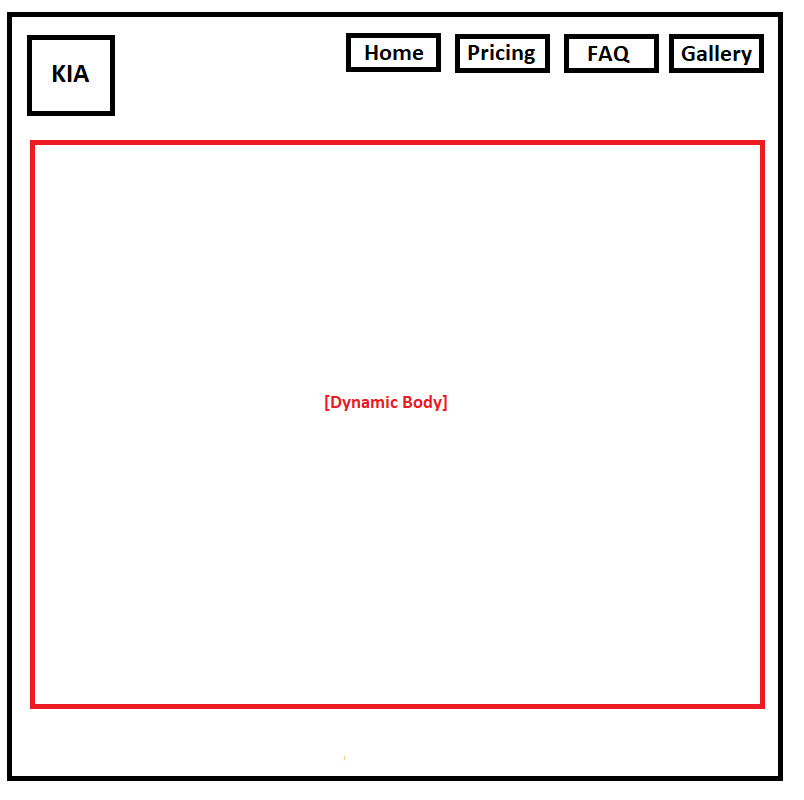
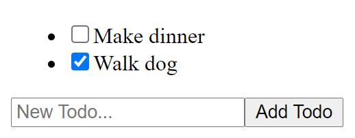

# Tute 07

## 1. Code Review

Take a look at the ReactJS app in `review/`. It is the ReactJS component from lab04.

What would you do to improve this source code? Discuss as a class.

- What is wrong with the style of the source code for this page?
- Make appropriate changes to clean up these DOM elements.

> Unnecessary repetition of null - can use `Array.from`
> Inconsistent usage of spaces for style, as well as indentation (focus on whitespace)
> Use of both `function() {}` syntax and `() => {}` syntax
> Use of `if else` branch where `switch` would work
> Rendering in return does not make use of conditional rendering

## 2. Fetching once

In the `exercise2` folder run `yarn` and then `yarn start`.

This basic application loads JSON information from github (via `fetch`) to display how many public repositories exist within the microsoft github organisation.

#### Part 1

Display the number of public repos collected from the fetch into the disabled input.

> See `solutions/exercise2`

#### Part 2

Have the `+` and `-` button that increase or decrease this value in the input by 1 respectively.

> See `solutions/exercise2`

Did you come across any issues with too many re-renders? How can we use `useEffect` to resolve this?

> Yes, it needs to be wrapped in a useEffect
> See `solutions/exercise2`

#### Part 3

Introduce a new input underneath that allows users to enter a string of the organisation they want to find the number of public repos of. After 500ms of the last keyup on this field, re-fire the fetch to get the new data and populate the input again. However, don't directly call fetch - instead, modify the useEffect capture.

> See `solutions/exercise2`

## 3. Managing state

In the `exercise3` folder run `yarn` and then `yarn start`.

Build a basic page that consists of a home icon (any logo - we put `KIA` as a placeholder), and 4 nav-bar items.

Using `React.useState`, have each of these 4 nav bar items load up a different ReactJS component into the app. You can stub each component with some simple text.

The home icon takes you to the same page as the `home` item in the nav bar.

> See `solutions/exercise3/src/App.js`

Note: This can also be done using `react-router-dom` as discussed in the `SPA` lecture.

> See `solutions/exercise3/src/App2.js`

## 4. Custom Hooks

In the `exercise3` folder run `yarn` and then `yarn start`.

Build a basic todo list that consists of a list of todo items and a form to add new items.

Using `React.useEffect`, save the todos to `localStorage`. Remember to use `JSON.stringify` since `localStorage` can only store strings.

Open the `Application` tab in the devtools and notice how the values change as you add todos and mark them complete.

Now update your todos `useState` to use the [function version](https://reactjs.org/docs/hooks-reference.html#lazy-initial-state) for its initial value. In the function read and parse the value from `localStorage` and use it as the initial value.

Extract the `useState` and `useEffect` for the todos to a new function called `useLocalStorageState` (the exact name of the function doesn't matter but it should start with `use` so eslint knows it's a hook). This function should receive the initial value (just like `useState`) and additionally a string key to read / write to localStorage as parameters. It should return the state and state setter functions from the `useState`.

Update the state for the new todo text to use this new hook.

> See `solutions/exercise4/src/App.js`
